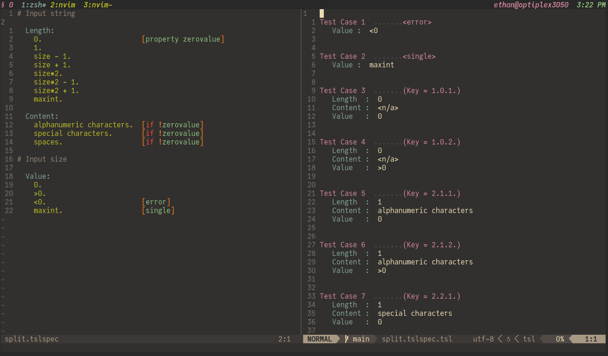

# About

This plugin provides language support for the Test Specification Language (TSL)
as specified by the [tsl generator][tsl generator] docs. The language was
originally described by the [Ostrand and Balcers 1988 CACM paper][o and b].

- Files ending with the extension `*.tslspec` will automatically be detected
  and set to a vim file type of `tslspec`.
- Files ending with the extension `*.tslspec.tsl` will automatically be
  detected and set to a vim file type of `tsl`.

# Installation

- If you use [vim-plug][vim-plug]

```vim
plug 'erietz/vim-tsl'
```

- If you use [packer.nvim][packer.nvim]

```vim
use 'erietz/vim-tsl'
```

[tsl generator]: https://github.com/alexorso/tslgenerator
[o and b]: http://www.cis.famu.edu/~cen5070joe/Lectures/CPM_paper.pdf
[vim-plug]: https://github.com/junegunn/vim-plug
[packer.nvim]: https://github.com/wbthomason/packer.nvim

